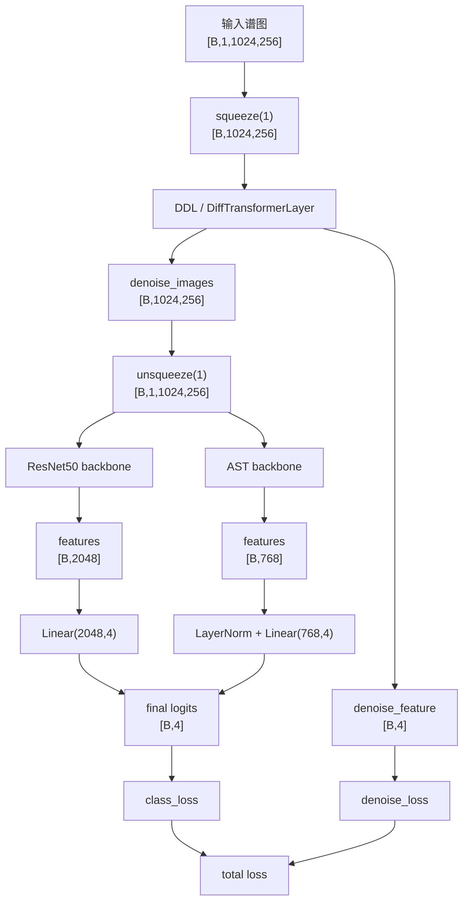

## 从输入谱图到最终 4 类输出：完整张量流总图

本文档给出本项目从**输入谱图**到**最终 4 类输出**的完整张量流总图，覆盖两条 backbone 分支：

- `DDL + ResNet50 + classifier`
- `DDL + AST + classifier`

默认输入尺寸基于当前项目实现：

- 输入谱图：`[B, 1, 1024, 256]`
- 4 类任务：`normal / crackle / wheeze / both`

相关代码位置：

- 训练主链路：[main.py](file:///c:/Ethan/code/cdssHomeWork20260604/ADD-RSC-homework20260604/main.py#L331-L338)
- DDL：[adapt_diff_denoise.py](file:///c:/Ethan/code/cdssHomeWork20260604/ADD-RSC-homework20260604/models/adapt_diff_denoise.py#L447-L506)
- ResNet50：[resnet.py](file:///c:/Ethan/code/cdssHomeWork20260604/ADD-RSC-homework20260604/models/resnet.py#L10-L47)
- AST：[ast.py](file:///c:/Ethan/code/cdssHomeWork20260604/ADD-RSC-homework20260604/models/ast.py#L29-L153)

---

## 1. 先看最核心的训练代码

在 [main.py](file:///c:/Ethan/code/cdssHomeWork20260604/ADD-RSC-homework20260604/main.py#L331-L338) 中，单个 batch 的主前向是：

```python
images = images.squeeze(1)
denoise_images, denoise_feature  = bias_denoise_encoder(images)
denoise_images = denoise_images.unsqueeze(1)
features = model(denoise_images)
output = classifier(features)
denoise_loss = criterion[1](denoise_feature, labels)
class_loss = criterion[0](output, labels)
loss = args.loss_beta * denoise_loss + (1 - args.loss_beta) * class_loss
```

所以主链路可以直接概括为：

```text
输入谱图
-> DDL 去噪
-> backbone 提特征
-> classifier 做 4 类分类
-> 输出 logits
```

---

## 2. 完整总图

```text
Dataset / DataLoader
输入谱图: [B, 1, 1024, 256]
    |
    | squeeze(1)
    v
DDL 输入: [B, 1024, 256]
    |
    | AFF(AFNO1D)
    | 输出: x1 [B, 1024, 256]
    |
    | 辅助分支:
    | x2 = (x1[:,0] + x1[:,1]) / 2
    | x2 -> Linear(256, 4)
    | denoise_feature: [B, 4]
    |
    | 主分支:
    | MHDA + residual
    | SwiGLU + residual
    v
denoise_images: [B, 1024, 256]
    |
    | unsqueeze(1)
    v
backbone 输入: [B, 1, 1024, 256]
    |
    +------------------------+
    |                        |
    | ResNet50 分支          | AST 分支
    |                        |
    v                        v
[B, 2048]                 [B, 768]
    |                        |
    | Linear(2048, 4)        | LayerNorm + Linear(768, 4)
    |                        |
    v                        v
final logits: [B, 4]      final logits: [B, 4]
    |
    +-----------> 与 labels 计算 class_loss

同时:
denoise_feature [B, 4]
    |
    +-----------> 与 labels 计算 denoise_loss

最终:
loss = beta * denoise_loss + (1 - beta) * class_loss
```

---

## 3. 输入谱图阶段

DataLoader 输出给训练循环的 `images` 形状是：

```text
[B, 1, 1024, 256]
```

语义上可理解为：

- `B`：batch size
- `1`：单通道谱图
- `1024`：一条空间轴
- `256`：另一条空间轴

进入训练循环后第一步是：

```python
images = images.squeeze(1)
```

因此送入 DDL 的输入变为：

```text
[B, 1024, 256]
```

这时 DDL 把它视为：

- 序列长度 `N = 1024`
- 特征维度 `C = 256`

---

## 4. DDL 内部张量流

DDL 的 forward 在 [DiffTransformerLayer](file:///c:/Ethan/code/cdssHomeWork20260604/ADD-RSC-homework20260604/models/adapt_diff_denoise.py#L475-L506)：

```python
x1 = self.aff(x)
x2 = (x1[:, 0] + x1[:, 1]) / 2
x2 = self.classifier(x2)
y = self.attn(self.norm1(x1)) + x1
z = self.ff(self.norm2(y)) + y
return z, x2
```

### 主分支

```text
x:  [B, 1024, 256]
-> AFF
x1: [B, 1024, 256]
-> RMSNorm
-> MHDA
-> residual
y:  [B, 1024, 256]
-> RMSNorm
-> SwiGLU
-> residual
z:  [B, 1024, 256]
```

最终主输出：

```text
denoise_images = z = [B, 1024, 256]
```

### 辅助分支

从 `x1` 里抽出前两个位置：

```python
x2 = (x1[:, 0] + x1[:, 1]) / 2
```

形状变化：

```text
x1[:, 0]: [B, 256]
x1[:, 1]: [B, 256]
平均后 x2: [B, 256]
-> Linear(256, 4)
denoise_feature: [B, 4]
```

所以 DDL 一次 forward 产生两个输出：

- `denoise_images: [B, 1024, 256]`
- `denoise_feature: [B, 4]`

---

## 5. 从 DDL 到 backbone 的接口

DDL 输出给 backbone 之前，会恢复单通道维：

```python
denoise_images = denoise_images.unsqueeze(1)
```

因此：

```text
[B, 1024, 256]
-> unsqueeze(1)
-> [B, 1, 1024, 256]
```

这就是 `ResNet50` 或 `AST` 实际接收到的输入形状。

---

## 6. ResNet50 分支张量流

ResNet50 主体见 [resnet.py](file:///c:/Ethan/code/cdssHomeWork20260604/ADD-RSC-homework20260604/models/resnet.py#L31-L47)。

### 输入

```text
[B, 1, 1024, 256]
```

### 各阶段形状变化

```text
conv1(7x7, stride=2)
-> [B, 64, 512, 128]

bn1 + relu
-> [B, 64, 512, 128]

maxpool(stride=2)
-> [B, 64, 256, 64]

layer1
-> [B, 256, 256, 64]

layer2
-> [B, 512, 128, 32]

layer3
-> [B, 1024, 64, 16]

layer4
-> [B, 2048, 32, 8]

avgpool
-> [B, 2048, 1, 1]

flatten
-> [B, 2048]
```

因此 ResNet50 backbone 输出：

```text
features = [B, 2048]
```

然后外部分类头：

```python
classifier = nn.Linear(2048, 4)
```

所以：

```text
[B, 2048] -> [B, 4]
```

最终得到：

```text
output logits = [B, 4]
```

---

## 7. AST 分支张量流

AST 主体见 [ast.py](file:///c:/Ethan/code/cdssHomeWork20260604/ADD-RSC-homework20260604/models/ast.py#L133-L153)。

### 输入

```text
[B, 1, 1024, 256]
```

### 轴交换

forward 第一行：

```python
x = x.transpose(2, 3)
```

因此变为：

```text
[B, 1, 256, 1024]
```

### patch embedding

使用：

- patch size = `16 x 16`
- stride = `16 x 16`

所以 patch 网格：

- `256 / 16 = 16`
- `1024 / 16 = 64`

patch 总数：

```text
16 * 64 = 1024
```

patch embedding 后：

```text
[B, 1024, 768]
```

### 加入特殊 token

```python
cls_tokens = self.v.cls_token.expand(B, -1, -1)
dist_token = self.v.dist_token.expand(B, -1, -1)
x = torch.cat((cls_tokens, dist_token, x), dim=1)
```

所以：

```text
[B, 1024, 768]
-> [B, 1026, 768]
```

### 加位置编码并通过 transformer blocks

```text
[B, 1026, 768]
-> + pos_embed
-> transformer blocks
-> norm
-> [B, 1026, 768]
```

### 取全局表示

```python
x = (x[:, 0] + x[:, 1]) / 2
```

所以最终 AST backbone 输出：

```text
features = [B, 768]
```

### 外部分类头

本项目里 AST 的外部 classifier 实际来自：

```python
classifier = deepcopy(model.mlp_head)
```

本质是：

```text
LayerNorm(768) + Linear(768, 4)
```

因此：

```text
[B, 768] -> [B, 4]
```

最终得到：

```text
output logits = [B, 4]
```

---

## 8. 两条 backbone 分支的对照图

```text
共同前端:
[B, 1, 1024, 256]
-> squeeze(1)
-> [B, 1024, 256]
-> DDL
-> denoise_images [B, 1024, 256]
-> unsqueeze(1)
-> [B, 1, 1024, 256]

ResNet50:
[B, 1, 1024, 256]
-> CNN backbone
-> [B, 2048]
-> Linear(2048, 4)
-> [B, 4]

AST:
[B, 1, 1024, 256]
-> transpose
-> [B, 1, 256, 1024]
-> PatchEmbed
-> [B, 1024, 768]
-> + cls/dist token
-> [B, 1026, 768]
-> Transformer blocks
-> [B, 768]
-> LayerNorm + Linear(768, 4)
-> [B, 4]
```

---

## 9. 损失分支总图

除了主分类输出，DDL 还额外产生：

```text
denoise_feature = [B, 4]
```

因此训练里实际上有两条监督：

```text
主分支:
output [B, 4] + labels [B]
-> CrossEntropyLoss
-> class_loss

辅助分支:
denoise_feature [B, 4] + labels [B]
-> LabelSmoothingLoss
-> denoise_loss
```

最后总损失：

\[
loss = \beta \cdot denoise\_loss + (1-\beta)\cdot class\_loss
\]

默认：

```text
beta = 0.5
```

---

## 10. 用 Mermaid 画一版总图



---

## 11. 最终可以把这条链路记成一句话

你可以把本项目完整张量流记成：

> 输入单通道谱图 `[B,1,1024,256]` 先去掉 channel 维送入 DDL，DDL 输出去噪后的三维特征 `[B,1024,256]` 和辅助分类输出 `[B,4]`；再把去噪特征恢复成四维谱图送入 `ResNet50` 或 `AST` backbone 提取全局特征，最后经外部分类头映射成 `[B,4]` 的四类 logits，并与辅助分支一起共同构成训练总损失。

