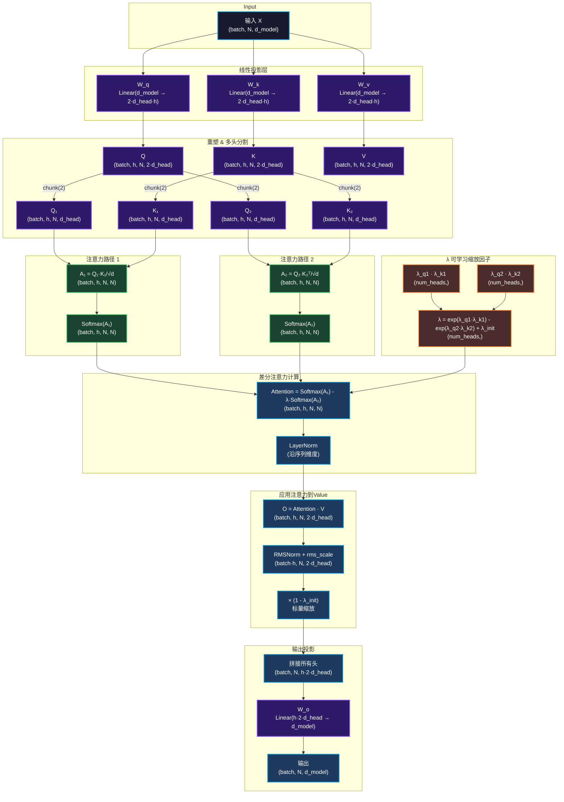

我来为你绘制 `MultiHeadDifferentialAttention` 的结构图。先让我查看完整的实现细节：


现在我来绘制详细的结构图：



## 核心流程说明

### 1️⃣ **线性投影** (第 225-227 行)
- 输入 `X` 通过三个线性层得到 Q, K, V
- 每个投影到 `2 × d_head × num_heads` 维度

### 2️⃣ **多头分割** (第 232-239 行)
- 将 Q, K, V 重塑为 `(batch, num_heads, N, 2·d_head)`
- 使用 `chunk(2)` 沿最后一个维度分割成 Q₁/Q₂ 和 K₁/K₂

### 3️ **双路注意力计算** (第 258-270 行)
```python
A1 = softmax(Q1·K1ᵀ/√d)  # 注意力路径1
A2 = softmax(Q2·K2ᵀ/√d)  # 注意力路径2
Attention = A1 - λ·A2     # 差分注意力（核心！）
```

### 4️⃣ **λ 可学习缩放因子** (第 245-247 行)
```python
λ = exp(λ_q1·λ_k1) - exp(λ_q2·λ_k2) + λ_init
```
- 4个可学习参数矩阵控制两路注意力的权重平衡

### 5️⃣ **差分后处理** (第 272-301 行)
- LayerNorm（沿序列维度归一化）
- 应用注意力到 V：`O = Attention · V`
- RMSNorm（沿特征维度归一化）
- 标量缩放：`× (1 - λ_init)`

### 6️⃣ **输出投影** (第 305-308 行)
- 拼接所有头的输出
- 通过 `W_o` 线性层映射回 `d_model` 维度

---

##  与传统注意力的关键区别

| 传统注意力 | 差分注意力 (MHDA) |
|-----------|------------------|
| `softmax(QKᵀ)·V` | `(softmax(Q₁K₁ᵀ) - λ·softmax(Q₂K₂ᵀ))·V` |
| 单路 softmax | **双路差分** |
| 对噪声敏感 | **过滤噪声敏感变化** |
| 无法区分噪声/信号 | **保留高置信度特征** |

这个结构的核心创新就是通过 **两路注意力差分** 来抑制噪声扰动，同时保留对分类关键的稳定特征！